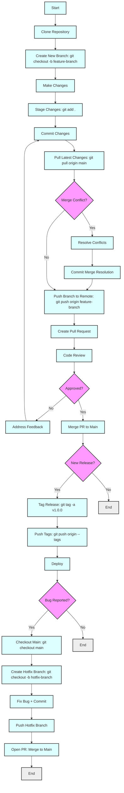

```mermaid
graph TD
    A[Start] --> B[Clone Repository]
    B --> C[Create New Branch: git checkout -b feature-branch]
    C --> D[Make Changes]
    D --> E[Stage Changes: git add .]
    E --> F[Commit Changes]
    F --> G[Pull Latest Changes: git pull origin main]
    G --> H{Merge Conflict?}
    H -- Yes --> I[Resolve Conflicts]
    I --> J[Commit Merge Resolution]
    J --> K[Push Branch to Remote: git push origin feature-branch]
    H -- No --> K
    K --> L[Create Pull Request]
    L --> M[Code Review]
    M --> N{Approved?}
    N -- No --> O[Address Feedback]
    O --> F
    N -- Yes --> P[Merge PR to Main]
    P --> Q{New Release?}
    Q -- Yes --> R[Tag Release: git tag -a v1.0.0]
    R --> S[Push Tags: git push origin --tags]
    S --> T[Deploy]
    Q -- No --> Q_alt[End]
    T --> U{Bug Reported?}
    U -- Yes --> V[Checkout Main: git checkout main]
    V --> W[Create Hotfix Branch: git checkout -b hotfix-branch]
    W --> X[Fix Bug + Commit]
    X --> Y[Push Hotfix Branch]
    Y --> Z[Open PR: Merge to Main]
    Z --> R_alt[End]
    U -- No --> U_alt[End]

    style A fill:#dff,stroke:#333,stroke-width:2px
    style B fill:#dff,stroke:#333,stroke-width:2px
    style C fill:#dff,stroke:#333,stroke-width:2px
    style D fill:#dff,stroke:#333,stroke-width:2px
    style E fill:#dff,stroke:#333,stroke-width:2px
    style F fill:#dff,stroke:#333,stroke-width:2px
    style G fill:#dff,stroke:#333,stroke-width:2px
    style H fill:#f9f,stroke:#333,stroke-width:2px
    style I fill:#dff,stroke:#333,stroke-width:2px
    style J fill:#dff,stroke:#333,stroke-width:2px
    style K fill:#dff,stroke:#333,stroke-width:2px
    style L fill:#dff,stroke:#333,stroke-width:2px
    style M fill:#dff,stroke:#333,stroke-width:2px
    style N fill:#f9f,stroke:#333,stroke-width:2px
    style O fill:#dff,stroke:#333,stroke-width:2px
    style P fill:#dff,stroke:#333,stroke-width:2px
    style Q fill:#f9f,stroke:#333,stroke-width:2px
    style R fill:#dff,stroke:#333,stroke-width:2px
    style S fill:#dff,stroke:#333,stroke-width:2px
    style T fill:#dff,stroke:#333,stroke-width:2px
    style U fill:#f9f,stroke:#333,stroke-width:2px
    style V fill:#dff,stroke:#333,stroke-width:2px
    style W fill:#dff,stroke:#333,stroke-width:2px
    style X fill:#dff,stroke:#333,stroke-width:2px
    style Y fill:#dff,stroke:#333,stroke-width:2px
    style Z fill:#dff,stroke:#333,stroke-width:2px
    style Q_alt fill:#eee,stroke:#333,stroke-width:2px
    style R_alt fill:#eee,stroke:#333,stroke-width:2px
    style U_alt fill:#eee,stroke:#333,stroke-width:2px
```
