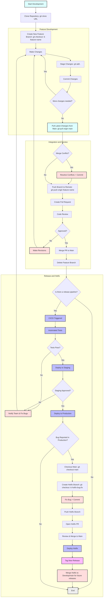

```mermaid
graph TD
    A[Start Development] --> B[Clone Repository: git clone URL]
    B --> C[Create New Feature Branch: git checkout -b feature-name]

    subgraph Feature Development
        C --> D[Make Changes]
        D --> E[Stage Changes: git add .]
        E --> F[Commit Changes]
        F --> G{More changes needed?}
        G -- Yes --> D
        G -- No --> H[Pull Latest Changes from Main: git pull origin main]
    end

    subgraph Integration and Review
        H --> I{Merge Conflict?}
        I -- Yes --> J[Resolve Conflicts + Commit]
        J --> K[Push Branch to Remote: git push origin feature-name]
        I -- No --> K
        K --> L[Create Pull Request]
        L --> M[Code Review]
        M --> N{Approved?}
        N -- No --> O[Make Revisions]
        O --> D
        N -- Yes --> P[Merge PR to Main]
        P --> Q[Delete Feature Branch]
    end

    subgraph Release and Hotfix
        Q --> R{Is there a release pipeline?}
        R -- Yes --> S[CI/CD Triggered]
        R -- No --> End
        S --> T[Automated Tests]
        T --> U{Tests Pass?}
        U -- Yes --> V[Deploy to Staging]
        U -- No --> W[Notify Team & Fix Bugs]
        W --> D
        V --> X{Staging Approved?}
        X -- Yes --> Y[Deploy to Production]
        X -- No --> W
        Y --> Z{Bug Reported in Production?}
        Z -- Yes --> AA[Checkout Main: git checkout main]
        AA --> BB[Create Hotfix Branch: git checkout -b hotfix-bug-fix]
        BB --> CC[Fix Bug + Commit]
        CC --> DD[Push Hotfix Branch]
        DD --> EE[Open Hotfix PR]
        EE --> FF[Review & Merge to Main]
        FF --> GG[Deploy Hotfix]
        GG --> HH[Tag New Release]
        HH --> II[Merge Hotfix to Develop/main for future releases]
        II --> End
        Z -- No --> End
    end
    
    style A fill:#dff,stroke:#333,stroke-width:2px
    style S fill:#bbf,stroke:#333,stroke-width:2px
    style T fill:#bbf,stroke:#333,stroke-width:2px
    style V fill:#bbf,stroke:#333,stroke-width:2px
    style Y fill:#bbf,stroke:#333,stroke-width:2px
    style GG fill:#bbf,stroke:#333,stroke-width:2px
    style HH fill:#fbf,stroke:#333,stroke-width:2px
    style J fill:#fdd,stroke:#333,stroke-width:2px
    style O fill:#fdd,stroke:#333,stroke-width:2px
    style W fill:#fdd,stroke:#333,stroke-width:2px
    style CC fill:#fdd,stroke:#333,stroke-width:2px
    style II fill:#fdd,stroke:#333,stroke-width:2px
    style H fill:#dff,stroke:#333,stroke-width:2px
    style End fill:#eee,stroke:#333,stroke-width:2px
```
