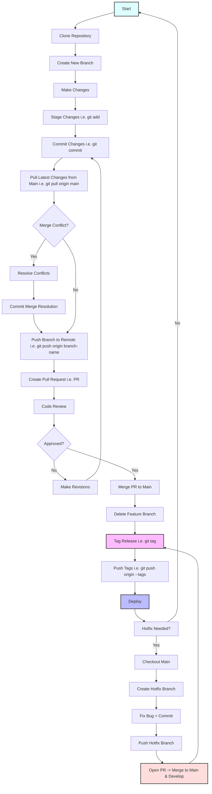

```mermaid
flowchart TD
    A[Start] --> B[Clone Repository]
    B --> C[Create New Branch]
    C --> D[Make Changes]
    D --> E[Stage Changes i.e. git add]
    E --> F[Commit Changes i.e. git commit]
    F --> G[Pull Latest Changes from Main i.e. git pull origin main]
    G --> H{Merge Conflict?}
    H -- Yes --> I[Resolve Conflicts]
    I --> J[Commit Merge Resolution]
    J --> K[Push Branch to Remote i.e. git push origin branch-name]
    H -- No --> K
    K --> L[Create Pull Request i.e. PR]
    L --> M[Code Review]
    M --> N{Approved?}
    N -- No --> O[Make Revisions]
    O --> F
    N -- Yes --> P[Merge PR to Main]
    P --> Q[Delete Feature Branch]
    Q --> R[Tag Release i.e. git tag]
    R --> S[Push Tags i.e. git push origin --tags]
    S --> T[Deploy]
    T --> U[Hotfix Needed?]
    U -- Yes --> V[Checkout Main]
    V --> W[Create Hotfix Branch]
    W --> X[Fix Bug + Commit]
    X --> Y[Push Hotfix Branch]
    Y --> Z[Open PR -> Merge to Main & Develop]
    Z --> R
    U -- No --> A

    style A fill:#dff,stroke:#333,stroke-width:2px
    style T fill:#bbf,stroke:#333,stroke-width:2px
    style R fill:#fbf,stroke:#333,stroke-width:2px
    style Z fill:#fdd,stroke:#333,stroke-width:2px
```
